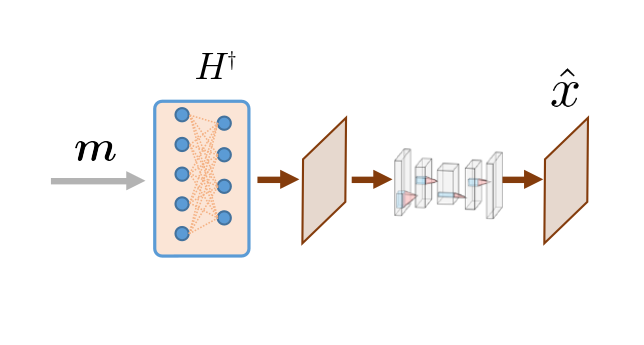

.. DO NOT EDIT.
.. THIS FILE WAS AUTOMATICALLY GENERATED BY SPHINX-GALLERY.
.. TO MAKE CHANGES, EDIT THE SOURCE PYTHON FILE:
.. "gallery\tuto_03_pseudoinverse_cnn_linear.py"
.. LINE NUMBERS ARE GIVEN BELOW.

.. only:: html

    .. note::
        :class: sphx-glr-download-link-note

        :ref:`Go to the end <sphx_glr_download_gallery_tuto_03_pseudoinverse_cnn_linear.py>`
        to download the full example code

.. rst-class:: sphx-glr-example-title

.. _sphx_glr_gallery_tuto_03_pseudoinverse_cnn_linear.py:

03. Pseudoinverse solution + CNN denoising
==========================================
.. _tuto_pseudoinverse_cnn_linear:

This tutorial shows how to simulate measurements and perform image reconstruction
using PinvNet (pseudoinverse linear network) with CNN denoising as a last layer.
This tutorial is a continuation of the :ref:`Pseudoinverse solution tutorial <tuto_pseudoinverse_linear>`
but uses a CNN denoiser instead of the identity operator in order to remove artefacts.

The measurement operator is chosen as a Hadamard matrix with positive coefficients,
which can be replaced by any matrix.

These tutorials load image samples from `/images/`.

.. GENERATED FROM PYTHON SOURCE LINES 18-20

Load a batch of images
-----------------------------------------------------------------------------

.. GENERATED FROM PYTHON SOURCE LINES 22-24

Images :math:`x` for training expect values in [-1,1]. The images are normalized
using the :func:`transform_gray_norm` function.

.. GENERATED FROM PYTHON SOURCE LINES 24-62

.. code-block:: Python

    import os

    import torch
    import torchvision
    import numpy as np
    import matplotlib.pyplot as plt

    from spyrit.misc.disp import imagesc
    from spyrit.misc.statistics import transform_gray_norm

    # sphinx_gallery_thumbnail_path = 'fig/pinvnet_cnn.png'

    h = 64  # image size hxh
    i = 1  # Image index (modify to change the image)
    spyritPath = os.getcwd()
    imgs_path = os.path.join(spyritPath, "images/")

    # Create a transform for natural images to normalized grayscale image tensors
    transform = transform_gray_norm(img_size=h)

    # Create dataset and loader (expects class folder 'images/test/')
    dataset = torchvision.datasets.ImageFolder(root=imgs_path, transform=transform)
    dataloader = torch.utils.data.DataLoader(dataset, batch_size=7)

    x, _ = next(iter(dataloader))
    print(f"Shape of input images: {x.shape}")

    # Select image
    x = x[i : i + 1, :, :, :]
    x = x.detach().clone()
    b, c, h, w = x.shape

    # plot
    x_plot = x.view(-1, h, h).cpu().numpy()
    imagesc(x_plot[0, :, :], r"$x$ in [-1, 1]")

.. GENERATED FROM PYTHON SOURCE LINES 63-65

Define a measurement operator
-----------------------------------------------------------------------------

.. GENERATED FROM PYTHON SOURCE LINES 67-71

We consider the case where the measurement matrix is the positive
component of a Hadamard matrix and the sampling operator preserves only
the first :attr:`M` low-frequency coefficients
(see :ref:`Positive Hadamard matrix <hadamard_positive>` for full explantion).

.. GENERATED FROM PYTHON SOURCE LINES 71-93

.. code-block:: Python

    import math
    from spyrit.misc.sampling import Permutation_Matrix
    from spyrit.misc.walsh_hadamard import walsh2_matrix

    F = walsh2_matrix(h)
    F = np.where(F > 0, F, 0)
    und = 4  # undersampling factor
    M = h**2 // und  # number of measurements (undersampling factor = 4)

    Sampling_map = np.ones((h, h))
    M_xy = math.ceil(M**0.5)
    Sampling_map[:, M_xy:] = 0
    Sampling_map[M_xy:, :] = 0

    Perm = Permutation_Matrix(Sampling_map)
    F = Perm @ F
    H = F[:M, :]
    print(f"Shape of the measurement matrix: {H.shape}")

    imagesc(Sampling_map, "low-frequency sampling map")

.. GENERATED FROM PYTHON SOURCE LINES 94-95

Then, we instantiate a :class:`spyrit.core.meas.Linear` measurement operator

.. GENERATED FROM PYTHON SOURCE LINES 95-100

.. code-block:: Python

    from spyrit.core.meas import Linear

    meas_op = Linear(H, pinv=True)

.. GENERATED FROM PYTHON SOURCE LINES 101-103

Noiseless case
-----------------------------------------------------------------------------

.. GENERATED FROM PYTHON SOURCE LINES 105-107

In the noiseless case, we consider the :class:`spyrit.core.noise.NoNoise` noise
operator

.. GENERATED FROM PYTHON SOURCE LINES 107-117

.. code-block:: Python

    from spyrit.core.noise import NoNoise

    N0 = 1.0  # Noise level (noiseless)
    noise = NoNoise(meas_op)

    # Simulate measurements
    y = noise(x.view(b * c, h * w))
    print(f"Shape of raw measurements: {y.shape}")

.. GENERATED FROM PYTHON SOURCE LINES 118-120

We now compute and plot the preprocessed measurements corresponding to an
image in [-1,1]

.. GENERATED FROM PYTHON SOURCE LINES 120-128

.. code-block:: Python

    from spyrit.core.prep import DirectPoisson

    prep = DirectPoisson(N0, meas_op)  # "Undo" the NoNoise operator

    m = prep(y)
    print(f"Shape of the preprocessed measurements: {m.shape}")

.. GENERATED FROM PYTHON SOURCE LINES 129-131

To display the subsampled measurement vector as an image in the transformed
domain, we use the :func:`spyrit.misc.sampling.meas2img` function

.. GENERATED FROM PYTHON SOURCE LINES 131-141

.. code-block:: Python

    # plot
    from spyrit.misc.sampling import meas2img

    m_plot = m.detach().numpy().squeeze()
    m_plot = meas2img(m_plot, Sampling_map)
    print(f"Shape of the preprocessed measurement image: {m_plot.shape}")

    imagesc(m_plot, "Preprocessed measurements (no noise)")

.. GENERATED FROM PYTHON SOURCE LINES 142-144

PinvNet Network
-----------------------------------------------------------------------------

.. GENERATED FROM PYTHON SOURCE LINES 146-150

We consider the :class:`spyrit.core.recon.PinvNet` class that reconstructs an
image by computing the pseudoinverse solution, which is fed to a neural
network denoiser. To compute the pseudoinverse solution only, the denoiser
can be set to the identity operator

.. GENERATED FROM PYTHON SOURCE LINES 150-155

.. code-block:: Python

    from spyrit.core.recon import PinvNet

    pinv_net = PinvNet(noise, prep, denoi=torch.nn.Identity())

.. GENERATED FROM PYTHON SOURCE LINES 156-157

or equivalently

.. GENERATED FROM PYTHON SOURCE LINES 157-159

.. code-block:: Python

    pinv_net = PinvNet(noise, prep)

.. GENERATED FROM PYTHON SOURCE LINES 160-162

Then, we reconstruct the image from the measurement vector :attr:`y` using the
:func:`~spyrit.core.recon.PinvNet.reconstruct` method

.. GENERATED FROM PYTHON SOURCE LINES 162-165

.. code-block:: Python

    x_rec = pinv_net.reconstruct(y)

.. GENERATED FROM PYTHON SOURCE LINES 166-168

Removing artefacts with a CNN
-----------------------------------------------------------------------------

.. GENERATED FROM PYTHON SOURCE LINES 170-174

Artefacts can be removed by selecting a neural network denoiser
(last layer of PinvNet). We select a simple CNN using the
:class:`spyrit.core.nnet.ConvNet` class, but this can be replaced by any
neural network (eg. UNet from :class:`spyrit.core.nnet.Unet`).

.. GENERATED FROM PYTHON SOURCE LINES 176-180

.. GENERATED FROM PYTHON SOURCE LINES 180-192

.. code-block:: Python

    from spyrit.core.nnet import ConvNet, Unet
    from spyrit.core.train import load_net

    # Define PInvNet with ConvNet denoising layer
    denoi = ConvNet()
    pinv_net_cnn = PinvNet(noise, prep, denoi)

    # Send to GPU if available
    device = torch.device("cuda:0" if torch.cuda.is_available() else "cpu")
    pinv_net_cnn = pinv_net_cnn.to(device)

.. GENERATED FROM PYTHON SOURCE LINES 193-195

As an example, we use a simple ConvNet that has been pretrained using STL-10 dataset.
We download the pretrained weights and load them into the network.

.. GENERATED FROM PYTHON SOURCE LINES 195-240

.. code-block:: Python

    # Load pretrained model
    model_path = "./model"
    num_epochs = 1

    pretrained_model_num = 3
    if pretrained_model_num == 1:
        # 1 epoch
        url_cnn = "https://drive.google.com/file/d/1iGjxOk06nlB5hSm3caIfx0vy2byQd-ZC/view?usp=drive_link"
        name_cnn = "pinv-net_cnn_stl10_N0_1_N_64_M_1024_epo_1_lr_0.001_sss_10_sdr_0.5_bs_512_reg_1e-07.pth"
        num_epochs = 1
    elif pretrained_model_num == 2:
        # 5 epochs
        url_cnn = "https://drive.google.com/file/d/1tzZg1lU3AxOi8-EVXFgnxdtqQCJPjQ9f/view?usp=drive_link"
        name_cnn = (
            "pinv-net_cnn_stl10_N0_1_N_64_M_1024_epo_5_lr_0.001_sss_10_sdr_0.5_bs_512.pth"
        )
        num_epochs = 5
    elif pretrained_model_num == 3:
        # 30 epochs
        url_cnn = "https://drive.google.com/file/d/1IZYff1xQxJ3ckAnObqAWyOure6Bjkj4k/view?usp=drive_link"
        name_cnn = "pinv-net_cnn_stl10_N0_1_N_64_M_1024_epo_30_lr_0.001_sss_10_sdr_0.5_bs_512_reg_1e-07.pth"
        num_epochs = 30

    # Create model folder
    if os.path.exists(model_path) is False:
        os.mkdir(model_path)
        print(f"Created {model_path}")

    # Download model weights
    model_cnn_path = os.path.join(model_path, name_cnn)
    print(model_cnn_path)
    if os.path.exists(model_cnn_path) is False:
        try:
            import gdown

            gdown.download(url_cnn, f"{model_cnn_path}.pth", quiet=False, fuzzy=True)
        except:
            print(f"Model {model_cnn_path} not downloaded!")

    # Load model weights
    load_net(model_cnn_path, pinv_net_cnn, device, False)
    print(f"Model {model_cnn_path} loaded.")

.. GENERATED FROM PYTHON SOURCE LINES 241-243

We now reconstruct the image using PinvNet with pretrained CNN denoising
and plot results side by side with the PinvNet without denoising

.. GENERATED FROM PYTHON SOURCE LINES 243-270

.. code-block:: Python

    with torch.no_grad():
        x_rec_cnn = pinv_net_cnn.reconstruct(y.to(device))
        x_rec_cnn = pinv_net_cnn(x.to(device))

    # plot
    x_plot = x.squeeze().cpu().numpy()
    x_plot2 = x_rec.squeeze().cpu().numpy()
    x_plot3 = x_rec_cnn.squeeze().cpu().numpy()

    from spyrit.misc.disp import add_colorbar, noaxis

    f, (ax1, ax2, ax3) = plt.subplots(1, 3, figsize=(15, 5))
    im1 = ax1.imshow(x_plot, cmap="gray")
    ax1.set_title("Ground-truth image", fontsize=20)
    noaxis(ax1)
    add_colorbar(im1, "bottom", size="20%")

    im2 = ax2.imshow(x_plot2, cmap="gray")
    ax2.set_title("Pinv reconstruction", fontsize=20)
    noaxis(ax2)
    add_colorbar(im2, "bottom", size="20%")

    im3 = ax3.imshow(x_plot3, cmap="gray")
    ax3.set_title(f"Pinv + CNN (trained {num_epochs} epochs", fontsize=20)
    noaxis(ax3)
    add_colorbar(im3, "bottom", size="20%")

.. GENERATED FROM PYTHON SOURCE LINES 271-272

We show the best result again (tutorial thumbnail purpose)

.. GENERATED FROM PYTHON SOURCE LINES 272-278

.. code-block:: Python

    # Plot
    imagesc(x_plot3, f"Pinv + CNN (trained {num_epochs} epochs", title_fontsize=20)

    plt.show()

.. GENERATED FROM PYTHON SOURCE LINES 279-280

In the next tutorial, we will show how to train PinvNet + CNN denoiser.

.. _sphx_glr_download_gallery_tuto_03_pseudoinverse_cnn_linear.py:

.. only:: html

  .. container:: sphx-glr-footer sphx-glr-footer-example

    .. container:: sphx-glr-download sphx-glr-download-jupyter

      :download:`Download Jupyter notebook: tuto_03_pseudoinverse_cnn_linear.ipynb <tuto_03_pseudoinverse_cnn_linear.ipynb>`

    .. container:: sphx-glr-download sphx-glr-download-python

      :download:`Download Python source code: tuto_03_pseudoinverse_cnn_linear.py <tuto_03_pseudoinverse_cnn_linear.py>`

.. only:: html

 .. rst-class:: sphx-glr-signature

    `Gallery generated by Sphinx-Gallery <https://sphinx-gallery.github.io>`_
