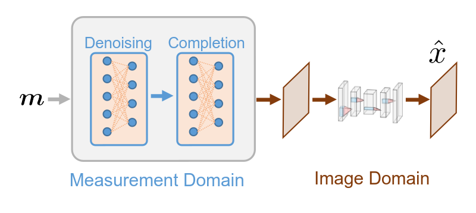

.. DO NOT EDIT.
.. THIS FILE WAS AUTOMATICALLY GENERATED BY SPHINX-GALLERY.
.. TO MAKE CHANGES, EDIT THE SOURCE PYTHON FILE:
.. "gallery\tuto_06_dcnet_split_measurements.py"
.. LINE NUMBERS ARE GIVEN BELOW.

.. only:: html

    .. note::
        :class: sphx-glr-download-link-note

        :ref:`Go to the end <sphx_glr_download_gallery_tuto_06_dcnet_split_measurements.py>`
        to download the full example code

.. rst-class:: sphx-glr-example-title

.. _sphx_glr_gallery_tuto_06_dcnet_split_measurements.py:

06. DCNet solution for split measurements
=========================================
.. _tuto_dcnet_split_measurements:

This tutorial shows how to perform image reconstruction using DCNet (data completion network) with
and without a trainable image denoiser. In the previous tutorial
:ref:`Acquisition - split measurements <tuto_acquisition_split_measurements>`
we showed how to handle split measurements for a Hadamard operator
and how to perform a pseudo-inverse reconstruction with PinvNet.

These tutorials load image samples from `/images/`.

.. GENERATED FROM PYTHON SOURCE LINES 16-18

Load a batch of images
-----------------------------------------------------------------------------

.. GENERATED FROM PYTHON SOURCE LINES 20-22

Images :math:`x` for training neural networks expect values in [-1,1]. The images are normalized
using the :func:`transform_gray_norm` function.

.. GENERATED FROM PYTHON SOURCE LINES 22-60

.. code-block:: Python

    import os

    import torch
    import torchvision
    import numpy as np
    import matplotlib.pyplot as plt

    from spyrit.misc.disp import imagesc
    from spyrit.misc.statistics import transform_gray_norm

    # sphinx_gallery_thumbnail_path = 'fig/dcnet.png'

    h = 64  # image size hxh
    i = 1  # Image index (modify to change the image)
    spyritPath = os.getcwd()
    imgs_path = os.path.join(spyritPath, "images/")

    # Create a transform for natural images to normalized grayscale image tensors
    transform = transform_gray_norm(img_size=h)

    # Create dataset and loader (expects class folder 'images/test/')
    dataset = torchvision.datasets.ImageFolder(root=imgs_path, transform=transform)
    dataloader = torch.utils.data.DataLoader(dataset, batch_size=7)

    x, _ = next(iter(dataloader))
    print(f"Shape of input images: {x.shape}")

    # Select image
    x = x[i : i + 1, :, :, :]
    x = x.detach().clone()
    b, c, h, w = x.shape

    # plot
    x_plot = x.view(-1, h, h).cpu().numpy()
    imagesc(x_plot[0, :, :], r"$x$ in [-1, 1]")

.. GENERATED FROM PYTHON SOURCE LINES 61-63

Forward operators for split measurements
-----------------------------------------------------------------------------

.. GENERATED FROM PYTHON SOURCE LINES 65-69

We consider noisy split measurements for a Hadamard operator and a
"variance subsampling" strategy that preserves the coefficients with the largest variance,
obtained from a previously estimated covariance matrix (for more details,
refer to :ref:`Acquisition - split measurements <tuto_acquisition_split_measurements>`).

.. GENERATED FROM PYTHON SOURCE LINES 71-72

First, we download the covariance matrix and load it.

.. GENERATED FROM PYTHON SOURCE LINES 72-102

.. code-block:: Python

    import girder_client

    # api Rest url of the warehouse
    url = "https://pilot-warehouse.creatis.insa-lyon.fr/api/v1"

    # Generate the warehouse client
    gc = girder_client.GirderClient(apiUrl=url)

    # Download the covariance matrix and mean image
    data_folder = "./stat/"
    dataId_list = [
        "63935b624d15dd536f0484a5",  # for reconstruction (imageNet, 64)
        "63935a224d15dd536f048496",  # for reconstruction (imageNet, 64)
    ]
    cov_name = "./stat/Cov_64x64.npy"

    try:
        for dataId in dataId_list:
            myfile = gc.getFile(dataId)
            gc.downloadFile(dataId, data_folder + myfile["name"])

        print(f"Created {data_folder}")

        Cov = np.load(cov_name)
        print(f"Cov matrix {cov_name} loaded")
    except:
        Cov = np.eye(h * h)
        print(f"Cov matrix {cov_name} not found! Set to the identity")

.. GENERATED FROM PYTHON SOURCE LINES 103-107

We define the measurement, noise and preprocessing operators and then
simulate a noiseless measurement vector :math:`y`. As in the previous tutorial,
we simulate an accelerated acquisition by subsampling the measurement matrix
by retaining only the first :math:`M` rows of a Hadamard matrix :math:`\textrm{Perm} H`.

.. GENERATED FROM PYTHON SOURCE LINES 107-138

.. code-block:: Python

    from spyrit.core.meas import HadamSplit
    from spyrit.core.noise import Poisson
    from spyrit.misc.sampling import meas2img2
    from spyrit.misc.statistics import Cov2Var
    from spyrit.core.prep import SplitPoisson

    # Measurement parameters
    M = 64 * 64 // 4  # Number of measurements (here, 1/4 of the pixels)
    alpha = 100.0  # number of photons

    # Ordering matrix
    Ord = Cov2Var(Cov)

    # Measurement and noise operators
    meas_op = HadamSplit(M, h, Ord)
    noise_op = Poisson(meas_op, alpha)
    prep_op = SplitPoisson(alpha, meas_op)

    # Vectorize image
    x = x.view(b * c, h * w)
    print(f"Shape of vectorized image: {x.shape}")

    # Measurements
    y = noise_op(x)  # a noisy measurement vector
    m = prep_op(y)  # preprocessed measurement vector

    m_plot = m.detach().numpy()
    m_plot = meas2img2(m_plot.T, Ord)
    imagesc(m_plot, r"Measurements $m$")

.. GENERATED FROM PYTHON SOURCE LINES 139-141

PinvNet network
-----------------------------------------------------------------------------

.. GENERATED FROM PYTHON SOURCE LINES 143-145

We reconstruct with the pseudo inverse using :class:`spyrit.core.recon.PinvNet` class
as in the previous tutorial. For this, we define the neural network and then perform the reconstruction.

.. GENERATED FROM PYTHON SOURCE LINES 145-161

.. code-block:: Python

    from spyrit.core.recon import PinvNet
    from spyrit.misc.disp import add_colorbar, noaxis

    # Reconstruction with for Core module (linear net)
    pinvnet = PinvNet(noise_op, prep_op)

    # use GPU, if available
    device = torch.device("cuda:0" if torch.cuda.is_available() else "cpu")

    # Pseudo-inverse net
    pinvnet = pinvnet.to(device)

    # Reconstruction
    with torch.no_grad():
        z_invnet = pinvnet.reconstruct(y.to(device))  # reconstruct from raw measurements

.. GENERATED FROM PYTHON SOURCE LINES 162-164

DCNet network
-----------------------------------------------------------------------------

.. GENERATED FROM PYTHON SOURCE LINES 166-178

We can improve PinvNet results by using the *denoised* completion network DCNet with the
:class:`spyrit.core.recon.DCNet` class. It has four sequential steps:

i) denoising of the acquired measurements,

ii) estimation of the missing measurements from the denoised ones,

iii) mapping them to the image domain, and

iv) denoising in the image-domain.

Only the last step involves learnable parameters.

.. GENERATED FROM PYTHON SOURCE LINES 180-184

.. GENERATED FROM PYTHON SOURCE LINES 186-189

For the denoiser, we compare the default unit matrix (no denoising) with the UNet denoiser
with the :class:`spyrit.core.nnet.Unet` class. For the latter, we load the pretrained model
weights.

.. GENERATED FROM PYTHON SOURCE LINES 191-192

Without *learnable image-domain* denoising

.. GENERATED FROM PYTHON SOURCE LINES 192-205

.. code-block:: Python

    from spyrit.core.recon import DCNet
    from spyrit.core.nnet import Unet
    from torch import nn

    # Reconstruction with for DCNet (linear net)
    dcnet = DCNet(noise_op, prep_op, Cov, denoi=nn.Identity())
    dcnet = dcnet.to(device)

    # Reconstruction
    with torch.no_grad():
        z_dcnet = dcnet.reconstruct(y.to(device))  # reconstruct from raw measurements

.. GENERATED FROM PYTHON SOURCE LINES 206-208

With a UNet denoising layer, we define the denoising network and
then load the pretrained weights.

.. GENERATED FROM PYTHON SOURCE LINES 208-254

.. code-block:: Python

    from spyrit.core.train import load_net
    import matplotlib.pyplot as plt
    from spyrit.misc.disp import add_colorbar, noaxis

    # Define UNet denoiser
    denoi = Unet()

    # Define DCNet (with UNet denoising)
    dcnet_unet = DCNet(noise_op, prep_op, Cov, denoi)
    dcnet_unet = dcnet_unet.to(device)

    # Load previously trained model
    # Download weights
    url_unet = "https://drive.google.com/file/d/15PRRZj5OxKpn1iJw78lGwUUBtTbFco1l/view?usp=drive_link"
    model_path = "./model"
    if os.path.exists(model_path) is False:
        os.mkdir(model_path)
        print(f"Created {model_path}")
    model_unet_path = os.path.join(
        model_path,
        "dc-net_unet_stl10_N0_100_N_64_M_1024_epo_30_lr_0.001_sss_10_sdr_0.5_bs_512_reg_1e-07.pth",
    )

    load_unet = True
    if os.path.exists(model_unet_path) is False:
        try:
            import gdown

            gdown.download(url_unet, f"{model_path}.pth", quiet=False, fuzzy=True)
        except:
            print(f"Model {model_unet_path} not found!")
            load_unet = False

    if load_unet:
        # Load pretrained model
        load_net(model_path, dcnet_unet, device, False)
        print(f"Model {model_path} loaded.")

    # Reconstruction
    with torch.no_grad():
        z_dcnet_unet = dcnet_unet.reconstruct(
            y.to(device)
        )  # reconstruct from raw measurements

.. GENERATED FROM PYTHON SOURCE LINES 255-256

We plot all results

.. GENERATED FROM PYTHON SOURCE LINES 256-286

.. code-block:: Python

    # plot reconstruction side by side
    x_plot = x.view(-1, h, h).cpu().numpy()
    x_plot2 = z_invnet.view(-1, h, h).cpu().numpy()
    x_plot3 = z_dcnet.view(-1, h, h).cpu().numpy()
    x_plot4 = z_dcnet_unet.view(-1, h, h).cpu().numpy()

    f, axs = plt.subplots(2, 2, figsize=(10, 10))
    im1 = axs[0, 0].imshow(x_plot[0, :, :], cmap="gray")
    axs[0, 0].set_title("Ground-truth image", fontsize=16)
    noaxis(axs[0, 0])
    add_colorbar(im1, "bottom")

    im2 = axs[0, 1].imshow(x_plot2[0, :, :], cmap="gray")
    axs[0, 1].set_title("PinvNet", fontsize=16)
    noaxis(axs[0, 1])
    add_colorbar(im2, "bottom")

    im3 = axs[1, 0].imshow(x_plot3[0, :, :], cmap="gray")
    axs[1, 0].set_title(f"DCNet (without denoising)", fontsize=16)
    noaxis(axs[1, 0])
    add_colorbar(im3, "bottom")

    im4 = axs[1, 1].imshow(x_plot4[0, :, :], cmap="gray")
    axs[1, 1].set_title(f"DCNet (UNet denoising)", fontsize=16)
    noaxis(axs[1, 1])
    add_colorbar(im4, "bottom")

    plt.show()

.. GENERATED FROM PYTHON SOURCE LINES 287-290

Comparing results, PinvNet provides pixelized reconstruction, DCNet with no denoising
leads to a smoother reconstruction, as expected by a Tikonov regularization, and
DCNet with UNet denoising provides the best reconstruction.

.. GENERATED FROM PYTHON SOURCE LINES 292-297

.. note::

      In this tutorial, we have used DCNet with a UNet denoising layer for split measurements.
      We refer to `spyrit-examples tutorials <https://github.com/openspyrit/spyrit-examples/tree/master/tutorial/tuto_core_2d_drunet.ipynb>`_
      for a comparison of different solutions for split measurements (pinvNet, DCNet and DRUNet).

.. _sphx_glr_download_gallery_tuto_06_dcnet_split_measurements.py:

.. only:: html

  .. container:: sphx-glr-footer sphx-glr-footer-example

    .. container:: sphx-glr-download sphx-glr-download-jupyter

      :download:`Download Jupyter notebook: tuto_06_dcnet_split_measurements.ipynb <tuto_06_dcnet_split_measurements.ipynb>`

    .. container:: sphx-glr-download sphx-glr-download-python

      :download:`Download Python source code: tuto_06_dcnet_split_measurements.py <tuto_06_dcnet_split_measurements.py>`

.. only:: html

 .. rst-class:: sphx-glr-signature

    `Gallery generated by Sphinx-Gallery <https://sphinx-gallery.github.io>`_
