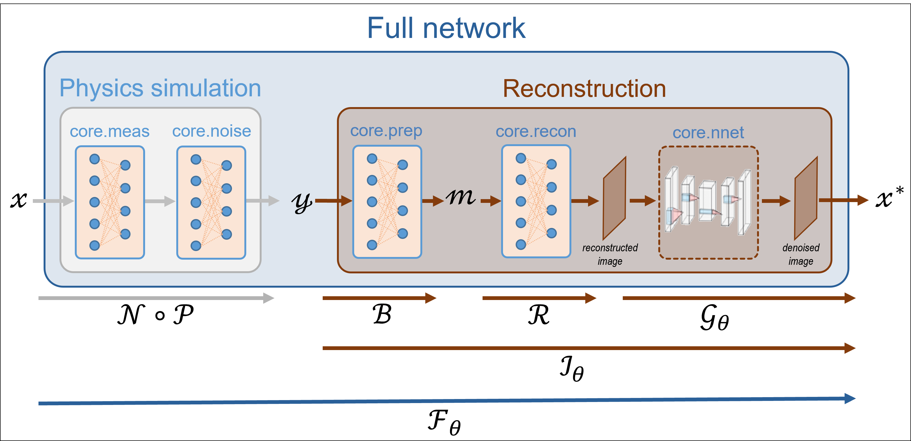

.. spyrit documentation master file, created by
   sphinx-quickstart on Fri Mar 12 11:04:59 2021.
   You can adapt this file completely to your liking, but it should at least
   contain the root `toctree` directive.

SPyRiT's documentation
==================================

SPyRiT is a `PyTorch <https://pytorch.org/>`_-based deep image reconstruction
package primarily designed for single-pixel imaging.

SPyRiT allows to simulate measurements and perform image reconstruction using
a full network. A full network is built using a measurement operator
:math:`\mathcal{P}`, a noise operator :math:`\mathcal{N}`, a preprocessing
operator :math:`\mathcal{B}`, a reconstruction operator :math:`\mathcal{R}`,
and a learnable neural network :math:`\mathcal{G}_{\theta}`. All operators
inherit from PyTorch's :class:`torch.nn.Module` class (`see here <https://pytorch.org/docs/stable/generated/torch.nn.Module.html>`_),
which allows them to be easily combined into a full network.

Getting started
==================================
The spyrit package is available for Linux, MacOs and Windows::

   pip install spyrit

Advanced installation guidelines are available on `GitHub <https://github.com/openspyrit/spyrit>`_.
Check out our `available tutorials <gallery/index.html>`_ to get started with SPyRiT.

Single-pixel imaging
==================================

Measurement model
-----------------------------------

Single-pixel imaging aims to recover an image :math:`x \in \mathbb{R}^N`
from a few noisy scalar products :math:`y \in \mathbb{R}^M`, where
:math:`M \ll N`. We model the acquisition as

      :math:`y = (\mathcal{N} \circ \mathcal{P})(x),`

where :math:`\mathcal{P}` is a linear operator that models the light patterns, 
:math:`\mathcal{N}` is a noise operator, and :math:`\circ` denotes the composition.

Image reconstruction
-----------------------------------

Learning-based reconstruction approaches estimate the unknown image as
:math:`x^* = \mathcal{I}_\theta(y)`, where :math:`\mathcal{I}_\theta`
represents the learnable parameters of the inversion model :math:`\mathcal{I}_\theta`.

A typical reconstruction operator :math:`\mathcal{I}_\theta` can be written as:

      :math:`\mathcal{I}_\theta = \mathcal{G}_\theta \circ \mathcal{R} \circ \mathcal{B},`

where :math:`\mathcal{B}` is a preprocessing operator, :math:`\mathcal{R}` is
a linear reconstruction operator, and :math:`\mathcal{G}_\theta` is
a trainable neural network or any available image-domain denoiser.

Learning phase
-----------------------------------

In the case of supervised learning, the training phase solves:

      :math:`\min_{\theta}{\sum_i \mathcal{L}\left(x_i,\mathcal{I}_\theta(y_i)\right)},`

where :math:`\mathcal{L}` is the training loss, and :math:`\{x_i,y_i\}_i` is a
set of training pairs.

To introduce the full network, a forward pass can be written as follows:

      :math:`F_{\theta}(x) = (\mathcal{G}_\theta \circ \mathcal{R} \circ \mathcal{B} \circ \mathcal{N} \circ \mathcal{P})(x).`

The full network can be trained using a database containing only images

      :math:`\min_{\theta}{\sum_i \mathcal{L}\left(x_i,\mathcal{F}_\theta(x_i)\right)}.`

The full network pipeline allows noisy data to be simulated on the fly,
providing data augmentation while avoiding storing the measurements.

Package structure
-----------------------------------

The main functionalities of SPyRiT are implemented in the subpackage
:class:`spyrit.core` , which contains 8 submodules:

1. **Measurement operators** (:mod:`spyrit.core.meas`) compute linear measurements :math:`\bar{y} = \mathcal{P}x`.

2. **Noise operators** (:mod:`spyrit.core.noise`) corrupt measurements :math:`y=\mathcal{N}(\bar{y})` with noise.

3. **Preprocessing operators** (:mod:`spyrit.core.prep`) are used to process noisy measurements, :math:`m=\mathcal{B}(y)`, before reconstruction. They typically
compensate for the image normalization previously performed.

4. **Reconstruction operators** (:mod:`spyrit.core.recon`) comprise both standard
linear reconstruction operators :math:`\mathcal{R}` and full network definitions
:math:`\mathcal{F}_\theta`.

5. **Neural networks** (:mod:`spyrit.core.nnet`) include well-known neural networks
:math:`\mathcal{G_{\theta}}`, generally used as denoiser layers.

6. **Training** (:mod:`spyrit.core.train`) provide the functionalities for training reconstruction networks.

Cite us
==================================
When using SPyRiT in scientific publications, please cite the following paper:

   - G. Beneti-Martin, L Mahieu-Williame, T Baudier, N Ducros, "OpenSpyrit: an Ecosystem for Reproducible Single-Pixel Hyperspectral Imaging," Optics Express, Vol. 31, No. 10, (2023). `DOI <https://doi.org/10.1364/OE.483937>`_.

When using SPyRiT specifically for the denoised completion network, please cite the following paper:

   - A Lorente Mur, P Leclerc, F Peyrin, and N Ducros, "Single-pixel image reconstruction from experimental data using neural networks," Opt. Express 29, 17097-17110 (2021). `DOI <https://doi.org/10.1364/OE.424228>`_.

Join the project
==================================
Feel free to contact us by `e-mail <mailto:nicolas.ducros@creatis.insa-lyon.fr>`_ for any question. Active developers are currently `Nicolas Ducros <https://www.creatis.insa-lyon.fr/~ducros/WebPage/index.html>`_, Thomas Baudier, `Juan Abascal <https://juanabascal78.wixsite.com/juan-abascal-webpage>`_ and Romain Phan.  Direct contributions via pull requests (PRs) are welcome.

The full list of contributors can be found `here <https://github.com/openspyrit/spyrit/blob/master/README.md#contributors-alphabetical-order>`_.

.. toctree::
   :maxdepth: 2
   :caption: Contents:
   :hidden:

   spyrit.core
   spyrit.misc

.. toctree::
   :maxdepth: 2
   :caption: Tutorials
   :hidden:

   gallery/index