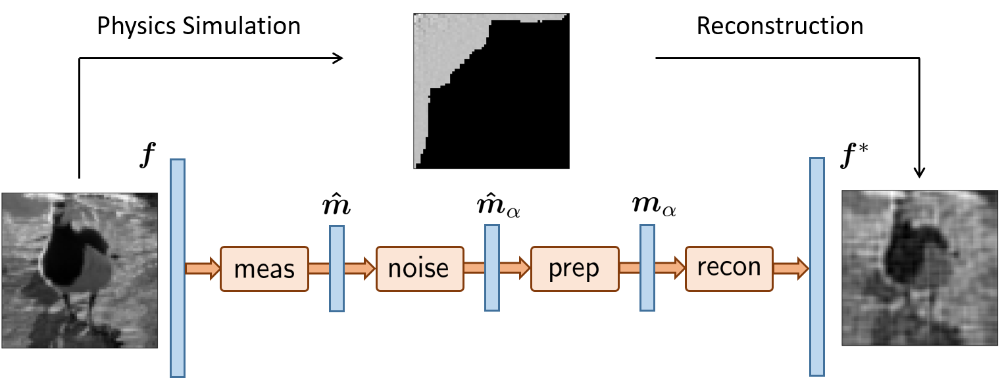

.. spyrit documentation master file, created by
   sphinx-quickstart on Fri Mar 12 11:04:59 2021.
   You can adapt this file completely to your liking, but it should at least
   contain the root `toctree` directive.

SPyRiT's documentation
==================================

SPyRiT is a `PyTorch <https://pytorch.org/>`_-based package for deep image 
reconstruction. While it is primarily designed for single-pixel image 
reconstruction, it can solve other linear reconstruction problems.

SPyRiT allows to simulate measurements and perform image reconstruction. 
Its main functionalities are impleted in the :class:`spyrit.core` subpackage, which contains six submodules:

1. **Measurement operators (meas)** compute linear measurements :math:`y = Hx` from 
   images :math:`x`, where :math:`H` is a linear operator (matrix) and :math:`x`
   is a vectorized image (see :mod:`spyrit.core.meas`).

2. **Noise operators (noise)** corrupt measurements :math:`y` with noise (see :mod:`spyrit.core.noise`).

3. **Preprocessing operators (prep)** are used to process noisy 
   measurements prior to reconstruction (see :mod:`spyrit.core.prep`).

4. **Reconstruction operators (recon)** define the predefined reconstruction networks, which include both forward and reconstruction layers (see :mod:`spyrit.core.recon`). 

5. **Neural networks (nnet)** include well-known neural networks, generally used as denoiser layers (see :mod:`spyrit.core.nnet`). 

6. **Training (train)** provide the functionalities for training reconstruction networks (see :mod:`spyrit.core.train`). 

.. toctree::
   :maxdepth: 5
   :caption: Contents:

   api/modules
   gallery/index

.. Indices and tables
    ==================
    
    * :ref:`genindex`
    * :ref:`modindex`
    * :ref:`search`

Installation
==================================
The spyrit package is available for Linux, MacOs and Windows::

   pip install spyrit

Advanced installation guidelines are available on `GitHub <https://github.com/openspyrit/spyrit>`_. 

Cite us
==================================
When using SPyRiT in scientific publications, please cite the following paper:

   - G. Beneti-Martin, L Mahieu-Williame, T Baudier, N Ducros, "OpenSpyrit: an Ecosystem for Reproducible Single-Pixel Hyperspectral Imaging," Optics Express, Vol. 31, No. 10, (2023). `DOI <https://doi.org/10.1364/OE.483937>`_.

When using SPyRiT specifically for the denoised completion network, please cite the following paper:

   - A Lorente Mur, P Leclerc, F Peyrin, and N Ducros, "Single-pixel image reconstruction from experimental data using neural networks," Opt. Express 29, 17097-17110 (2021). `DOI <https://doi.org/10.1364/OE.424228>`_.

Join the project
==================================
Feel free to contact us by `e-mail <mailto:nicolas.ducros@creatis.insa-lyon.fr>` for any question. Active developers are currently `Nicolas Ducros <https://www.creatis.insa-lyon.fr/~ducros/WebPage/index.html>`_, Thomas Baudier  and `Juan Abascal <https://juanabascal78.wixsite.com/juan-abascal-webpage>`_.  Direct contributions via pull requests (PRs) are welcome. 

The full list of contributors can be found `here <https://github.com/openspyrit/spyrit/blob/master/README.md#contributors-alphabetical-order>`_. 
