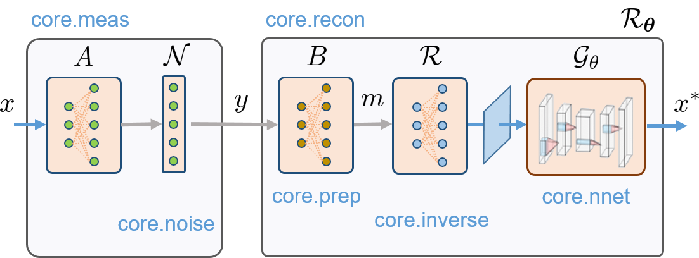

.. spyrit documentation master file, created by
   sphinx-quickstart on Fri Mar 12 11:04:59 2021.
   You can adapt this file completely to your liking, but it should at least
   contain the root `toctree` directive.

SPyRiT: a Single-Pixel image Reconstruction Toolkit based on PyTorch
#####################################

SPyRiT is a `PyTorch <https://pytorch.org/>`_-based image reconstruction
package designed for single-pixel imaging. SPyRiT is modular and may be useful for other inverse problems.

Getting started
==================================

Installation
-----------------------------------
The SPyRiT package is available for Linux, MacOs and Windows::

   pip install spyrit

Advanced installation guidelines are available on `GitHub <https://github.com/openspyrit/spyrit>`_.

Tutorials and code examples
-----------------------------------
To get started with SPyRiT, check out our `tutorials <gallery/index.html>`_ as well as the  `examples <https://github.com/openspyrit/spyrit-examples>`_ on GitHub.

Cite us
==================================
When using SPyRiT 3 in scientific publications, please cite the following paper:

   - JFJP Abascal, T Baudier, R Phan, A Repetti, N Ducros, "SPyRiT 3.0: an open source package for single-pixel imaging based on deep learning," Preprint (2024).
   
When using SPyRiT 2 in scientific publications, please cite the following paper:

   - G. Beneti-Martin, L Mahieu-Williame, T Baudier, N Ducros, "OpenSpyrit: an Ecosystem for Reproducible Single-Pixel Hyperspectral Imaging," Optics Express, Vol. 31, No. 10, (2023). `DOI <https://doi.org/10.1364/OE.483937>`_.

When using SPyRiT specifically for the denoised completion network, please cite the following paper:

   - A Lorente Mur, P Leclerc, F Peyrin, and N Ducros, "Single-pixel image reconstruction from experimental data using neural networks," Opt. Express 29, 17097-17110 (2021). `DOI <https://doi.org/10.1364/OE.424228>`_.

Join the project
==================================
Feel free to contact us by `e-mail <mailto:nicolas.ducros@creatis.insa-lyon.fr>`_ for any question. Direct contributions via pull requests (PRs) are welcome.

The full list of contributors can be found `here <https://github.com/openspyrit/spyrit/blob/master/README.md#contributors-alphabetical-order>`_.

Single-pixel imaging
==================================
.. _principle:
.. image:: fig/spi_principle.png
   :width: 800
   :align: center

Single-pixel imaging aims to recover an unknown image :math:`x\in\mathbb{R}^N` from a few noisy observations 

.. math::
    m \approx Hx,

where :math:`H\colon  \mathbb{R}^{M\times N}` is a linear measurement operator, :math:`M` is the number of measurements and :math:`N` is the number of pixels in the image.

Simulation of the measurements
-----------------------------------
In practice, measurements are obtained by uploading a set of light patterns onto a spatial light modulator (e.g., a digital micromirror device (DMD), see :ref:`principle`). Therefore, only positive patterns can be implemented. We model the actual acquisition process as 

.. math::
    y = \mathcal{N}(Ax)

where :math:`\mathcal{N} \colon \mathbb{R}^J \to \mathbb{R}^J` represents a noise operator (e.g., Poisson or Poisson-Gaussian), :math:`A \in \mathbb{R}_+^{J\times N}` is the actual acquisition operator that models the (positive) DMD patterns, and :math:`J` is the number of DMD patterns. 

Handling non negativity with pre-processing
-----------------------------------
We may preprocess the measurements before reconstruction to transform the actual measurements into the target measurements

.. math::
    m = By \approx Hx

where :math:`B\colon\mathbb{R}^{J}\to \mathbb{R}^{M}` is the preprocessing operator chosen such that :math:`BA=H`. Note that the noise of the preprocessed measurements :math:`m=By` is not the same as that of the actual measurements :math:`y`. 

Data-driven image reconstruction
-----------------------------------
Data-driven methods based on deep learning aim to find an estimate :math:`x^*\in \mathbb{R}^N` of the unknown image :math:`x` from the preprocessed measurements :math:`By`, using a reconstruction operator :math:`\mathcal{R}_{\theta^*} \colon \mathbb{R}^M \to \mathbb{R}^N`

.. math::
    \mathcal{R}_{\theta^*}(m) = x^* \approx x, 

where :math:`\theta^*` represents the parameters learned during a training procedure. 

Learning phase
-----------------------------------
In the case of supervised learning, it is assumed that a training dataset :math:`\{x^{(i)},y^{(i)}\}_{1 \le i \le I}` of :math:`I` pairs of ground truth images in :math:`\mathbb{R}^N` and measurements in :math:`\mathbb{R}^M` is available}. :math:`\theta^*` is then obtained by solving 

.. math::
    \min{\theta}{\sum_{i =1}^I \mathcal{L}\left(x^{(i)},\mathcal{R}_\theta(By^{(i)})\right)},

where :math:`\mathcal{L}` is the training loss (e.g., squared error). In the case where only ground truth images :math:`\{x^{(i)}\}_{1 \le i \le I}` are available, the associated measurements are simulated as :math:`y^{(i)} = \op{N}(Ax^{(i)})`, :math:`1 \le i \le I`.

Reconstruction operator
-----------------------------------
A simple yet efficient method consists in correcting a traditional (e.g. linear) reconstruction by a data-driven nonlinear step 

.. math::
    \mathcal{R}_\theta = \mathcal{G}_\theta \circ \mathcal{R},  
    
where :math:`\mathcal{R}\colon\mathbb{R}^{M}\to\mathbb{R}^N` is a traditional hand-crafted (e.g., regularized) reconstruction operator and :math:`\mathcal{G}_\theta\colon\mathbb{R}^{N}\to\mathbb{R}^N` is a nonlinear neural network that acts in the image domain. 

Algorithm unfolding consists in defining :math:`\mathcal{R}_\theta` from an iterative scheme

.. math::
    \mathcal{R}_\theta = \mathcal{R}_{\theta_K} \circ ... \circ \mathcal{R}_{\theta_1},

where :math:`\mathcal{R}_{\theta_k}` can be interpreted as the computation of the :math:`k`-th iteration of the iterative scheme and :math:`\theta = \bigcup_{k} \theta_k`.

Organization of the package
==================================

Typical pipeline
-----------------------------------

SPyRiT allows to simulate measurements and perform image reconstruction using
a full network. A full network is built from a measurement operator
:math:`\mathcal{P}`, a noise operator :math:`\mathcal{N}`, a preprocessing
operator :math:`\mathcal{B}`, a reconstruction operator :math:`\mathcal{R}`,
and a learnable neural network :math:`\mathcal{G}_{\theta}`. All operators
inherit from PyTorch's :class:`torch.nn.Module` class (`see here <https://pytorch.org/docs/stable/generated/torch.nn.Module.html>`_),
which allows them to be easily combined into a full network.

Submodules
-----------------------------------

SPyRiT has a modular structure with the core functionality organised in the 8 submodules of
:class:`spyrit.core`. 

1. :mod:`spyrit.core.meas` provides measurement operators that compute linear measurements corresponding to `A` in \Eq{eq:acquisition}. It also provides the adjoint and the pseudoinverse of `A`, which are the basis of any reconstruction algorithm.
    
2. :mod:`spyrit.core.noise` provides noise operators corresponding to `\mathcal{N}` in \Eq{eq:acquisition}.

3. :mod:`spyrit.core.prep` provides preprocessing operators for the operator `B` introduced in \Eq{eq:prep}. 
    
4. :mod:`spyrit.core.nnet` provides known neural networks corresponding to `\mathcal{G}` in \Eq{eq:recon_direct} or \Eq{eq:pgd_no_Gamma}.

5. :mod:`spyrit.core.recon` returns the reconstruction operator corresponding to `\mathcal{R}`. 

6. :mod:`spyrit.core.warp` provides the functionality to solve the minimisation problem of \Eq{eq:train}. 

7. :mod:`spyrit.core.warp` contains the operators used for dynamic acquisitions.

8. :mod:`spyrit.core.torch` contains utility functions.

In addition, the subpackage :class:`spyrit.misc` contains various utility functions for Numpy / PyTorch that can be used independently of the core functions.

.. autosummary::
   :toctree: _autosummary
   :template: spyrit-module-template.rst
   :recursive:
   :caption: Contents

   spyrit.core
   spyrit.misc
   spyrit.external

.. toctree::
   :maxdepth: 2
   :caption: Tutorials
   :hidden:

   gallery/index
