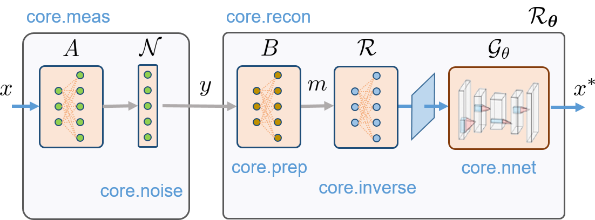

Organisation of the package
==================================

SPyRiT's typical pipeline. 

SPyRiT allows to simulate measurements and perform image reconstruction using
a full network. A full network includes a measurement operator
:math:`A`, a noise operator :math:`\mathcal{N}`, a preprocessing
operator :math:`B`, a reconstruction operator :math:`\mathcal{R}`,
and a learnable neural network :math:`\mathcal{G}_{\theta}`. All operators
inherit from :class:`torch.nn.Module`.

Submodules
-----------------------------------

SPyRiT has a modular structure with the core functionality organised in the 8 submodules of
:mod:`spyrit.core`. 

1. :mod:`spyrit.core.meas` provides measurement operators that compute linear measurements corresponding to :math:`A` in Eq. :eq:`eq_acquisition`. It also provides the adjoint and the pseudoinverse of :math:`A`, which are the basis of any reconstruction algorithm.
    
2. :mod:`spyrit.core.noise` provides noise operators corresponding to :math:`\mathcal{N}` in Eq. :eq:`eq_acquisition`.

3. :mod:`spyrit.core.prep` provides preprocessing operators for the operator :math:`B` introduced in Eq. :eq:`eq_prep`. 
    
4. :mod:`spyrit.core.nnet` provides known neural networks corresponding to :math:`\mathcal{G}` in Eq. :eq:`eq_recon_direct` or Eq. :eq:`eq_pgd_no_Gamma`.

5. :mod:`spyrit.core.recon` returns the reconstruction operator corresponding to :math:`\mathcal{R}`. 

6. :mod:`spyrit.core.train` provides the functionality to solve the minimisation problem of Eq. :eq:`eq_train`. 

7. :mod:`spyrit.core.warp` contains the operators used for dynamic acquisitions.

8. :mod:`spyrit.core.torch` contains utility functions.

In addition, :mod:`spyrit.misc` contains various utility functions for Numpy / PyTorch that can be used independently of the core functions.

Finally, :mod:`spyrit.external` provides access to `DR-UNet <https://github.com/cszn/DPIR/blob/master/models/network_unet.py>`_.