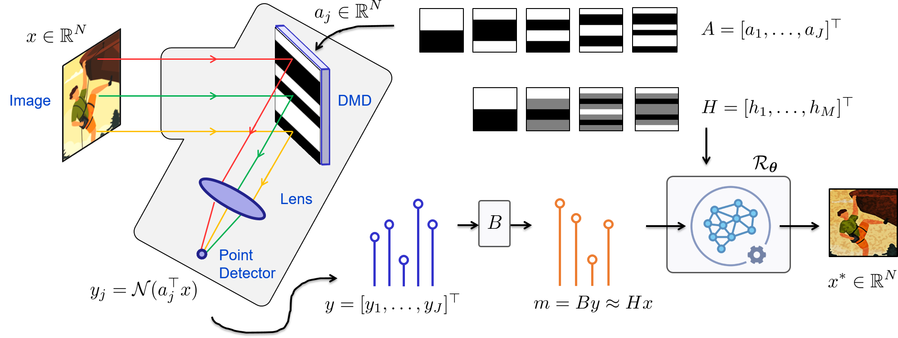

Single-pixel imaging
==================================
.. _principle:

Overview of the principle of single-pixel imaging.

Simulation of the measurements
-----------------------------------
Single-pixel imaging aims to recover an unknown image :math:`x\in\mathbb{R}^N` from a few noisy observations 

.. math::
    m \approx Hx,

where :math:`H\colon  \mathbb{R}^{M\times N}` is a linear measurement operator, :math:`M` is the number of measurements and :math:`N` is the number of pixels in the image.

In practice, measurements are obtained by uploading a set of light patterns onto a spatial light modulator (e.g., a digital micromirror device (DMD), see :ref:`principle`). Therefore, only positive patterns can be implemented. We model the actual acquisition process as 

.. math::
    :label: eq_acquisition
    
    y = \mathcal{N}(Ax)

where :math:`\mathcal{N} \colon \mathbb{R}^J \to \mathbb{R}^J` represents a noise operator (e.g., Poisson or Poisson-Gaussian), :math:`A \in \mathbb{R}_+^{J\times N}` is the actual acquisition operator that models the (positive) DMD patterns, and :math:`J` is the number of DMD patterns. 

Handling non negativity with pre-processing
----------------------------------------------------------------------
We may preprocess the measurements before reconstruction to transform the actual measurements into the target measurements

.. math::
    :label: eq_prep
    
    m = By \approx Hx
    

where :math:`B\colon\mathbb{R}^{J}\to \mathbb{R}^{M}` is the preprocessing operator chosen such that :math:`BA=H`. Note that the noise of the preprocessed measurements :math:`m=By` is not the same as that of the actual measurements :math:`y`. 

Data-driven image reconstruction
-----------------------------------
Data-driven methods based on deep learning aim to find an estimate :math:`x^*\in \mathbb{R}^N` of the unknown image :math:`x` from the preprocessed measurements :math:`By`, using a reconstruction operator :math:`\mathcal{R}_{\theta^*} \colon \mathbb{R}^M \to \mathbb{R}^N`

.. math::
    \mathcal{R}_{\theta^*}(m) = x^* \approx x, 

where :math:`\theta^*` represents the parameters learned during a training procedure. 

Learning phase
-----------------------------------
In the case of supervised learning, it is assumed that a training dataset :math:`\{x^{(i)},y^{(i)}\}_{1 \le i \le I}` of :math:`I` pairs of ground truth images in :math:`\mathbb{R}^N` and measurements in :math:`\mathbb{R}^M` is available}. :math:`\theta^*` is then obtained by solving 

.. math::
    :label: eq_train
    
    \min_{\theta}\,{\sum_{i =1}^I \mathcal{L}\left(x^{(i)},\mathcal{R}_\theta(By^{(i)})\right)},
    

where :math:`\mathcal{L}` is the training loss (e.g., squared error). In the case where only ground truth images :math:`\{x^{(i)}\}_{1 \le i \le I}` are available, the associated measurements are simulated as :math:`y^{(i)} = \mathcal{N}(Ax^{(i)})`, :math:`1 \le i \le I`.

Reconstruction operator
-----------------------------------
A simple yet efficient method consists in correcting a traditional (e.g. linear) reconstruction by a data-driven nonlinear step 

.. math::
    :label: eq_recon_direct
    
    \mathcal{R}_\theta = \mathcal{G}_\theta \circ \mathcal{R},
    
where :math:`\mathcal{R}\colon\mathbb{R}^{M}\to\mathbb{R}^N` is a traditional hand-crafted (e.g., regularized) reconstruction operator and :math:`\mathcal{G}_\theta\colon\mathbb{R}^{N}\to\mathbb{R}^N` is a nonlinear neural network that acts in the image domain. 

Algorithm unfolding consists in defining :math:`\mathcal{R}_\theta` from an iterative scheme

.. math::
    :label: eq_pgd_no_Gamma

    \mathcal{R}_\theta = \mathcal{R}_{\theta_K} \circ ... \circ \mathcal{R}_{\theta_1}, 

where :math:`\mathcal{R}_{\theta_k}` can be interpreted as the computation of the :math:`k`-th iteration of the iterative scheme and :math:`\theta = \bigcup_{k} \theta_k`.